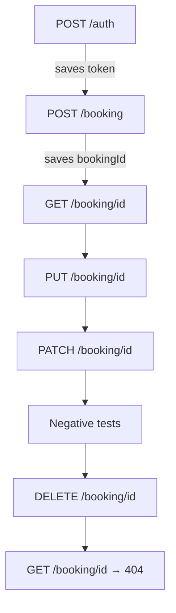

# Restful Booker – API Tests


API test suite for the [Restful Booker](https://restful-booker.herokuapp.com/apidoc/index.html) practice API.
The tests are written in **Postman** and run in **GitHub Actions** with **Newman**.

## What this project tests

| Area | Tests |
|---|---|
| Authentication | Get a token. Reject an incorrect password. |
| CRUD workflow | Create, read, update (PUT), partially update (PATCH), and delete a booking. |
| Data validation | Each response contains the data that was sent. |
| Response structure | JSON schema validation (schema from the API documentation). |
| Negative cases | Missing field, incorrect data type, no token, record that does not exist. |
| Known bugs | Bugs found during testing, kept as regression tests. |

## Test flow



## Project structure

```
restful-booker-api-tests/
├── collection/
│   ├── restful-booker.postman_collection.json
│   └── restful-booker.postman_environment.json
├── .github/workflows/api-tests.yml
└── README.md
```

The collection has four folders. The Runner and Newman run them in this sequence:

| Folder | Content |
|---|---|
| 01 Auth | Get the token. |
| 02 Happy Path | Create, read, and update a booking. |
| 03 Negative | Send incorrect data and requests without a token. |
| 04 Cleanup | Delete the booking. Make sure that it does not exist. |

## Test design

- **Chaining:** The token and the booking ID move from one request to the next through environment variables.
- **Dynamic test data:** Postman generates a new name for each run. The tests compare the response with the generated values.
- **Schema validation:** The schemas come from the API documentation, not from the current response.
- **Negative tests:** Each negative test changes only one item. All other data stays correct.
- **Known bugs:** Tests marked `[BUG]` expect the correct behavior. They fail until the bug is fixed.
  In CI they are skipped (`includeKnownBugs = false`), so the pipeline shows only new failures.
  Set `includeKnownBugs = true` to run them.

## Known bugs found

| Request | Actual | Expected | Reference |
|---|---|---|---|
| `POST /auth` with an incorrect password | `200 OK` with `"Bad credentials"` | `401 Unauthorized` | — |
| `POST /booking` without `firstname` | `500 Internal Server Error` | `400 Bad Request` | API doc: all fields are required |
| `POST /booking` with `totalprice` as text | `500 Internal Server Error` | `400 Bad Request` | API doc: `totalprice` is a Number |
| `PUT /booking/{id}` for an ID that does not exist | `405 Method Not Allowed` | `404 Not Found` | — |
| `DELETE /booking/{id}` | `201 Created` | `200 OK` or `204 No Content` | — |

## How to run the tests

### In Postman
1. Import both files from the `collection/` folder.
2. Select the **Restful Booker** environment.
3. Run the collection in the Collection Runner.

### With Newman (command line)
```bash
npm install -g newman newman-reporter-htmlextra
newman run collection/restful-booker.postman_collection.json \
  -e collection/restful-booker.postman_environment.json \
  -r cli,htmlextra --reporter-htmlextra-export reports/report.html
```

Run the known-bug tests too:
```bash
newman run collection/restful-booker.postman_collection.json \
  -e collection/restful-booker.postman_environment.json \
  --env-var "includeKnownBugs=true"
```

## CI/CD

GitHub Actions runs the tests on each push and pull request, and manually from the **Actions** tab.
The HTML report is available as an artifact on each workflow run.

## Notes

- Restful Booker is a public practice API. It resets its data at intervals and can be slow or unavailable.
  A failed run can be caused by the service and not by the tests.
- The environment file contains no token. The tests get a new token on each run.
